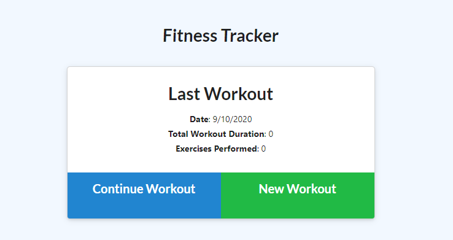
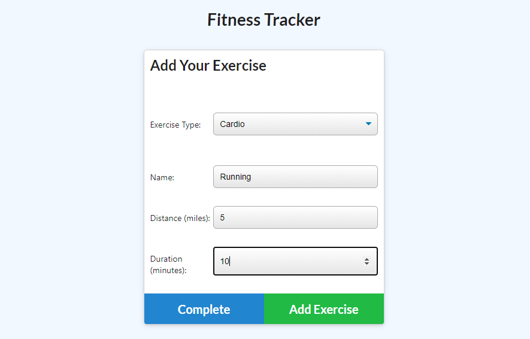

# Fitness Tracker
## Welcome to my [Fitness Tracker](https://young-meadow-67937.herokuapp.com/exercise?id=5f616946a878480017220bb9)
 

# Description
This nodejs application helps users to log multiple exercises in a workout on a given day. The users will be able to track the name, type, weight, sets, reps, duration, and distance traveled after everytime they complete a workout.

# Installation
- Go to the active website [here](https://young-meadow-67937.herokuapp.com/exercise?id=5f616946a878480017220bb9)
OR
- Use it locally:
1. Clone this folder from github
2. In the terminal, run the command "npm i"
3. To run the application, run the command "node server.js". Then open your browser and run "localhost:3000"

## Questions
Find me on github: [bnguyen467](https://github.com/bnguyen467)
 
Contact me through email: 467bnguyen@gmail.com

### This is how the application looks like:

